# 2020.09.23Unity3D_DOTS

[https://www.one-tab.com/page/tuqF6e_MTfK3MffX25pRpw](https://www.one-tab.com/page/tuqF6e_MTfK3MffX25pRpw)

## DOTS是如何运作的

### 原型(Archetypes)

### 内存块(Memory Chunks)

###  Authoring(作者)
#### 什么是Authoring
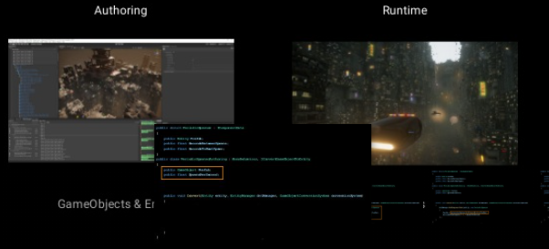
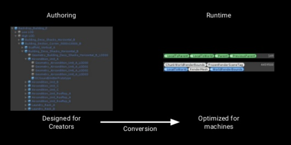
通过上图我们可以看到Authoring的含义就是编辑器模式


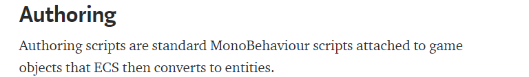

Gameobject和Entirely的交换器


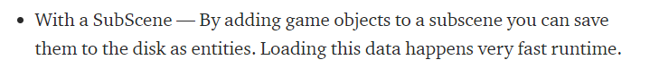
### 什么是世界(world)

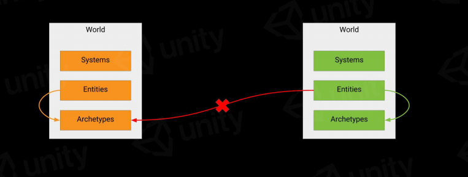

Unity3D支持多个世界,使用World这个概念来支持它.

### 什么是Entities和EntityManager

实体是实体组件系统体系结构的三个主要元素之一。它们代表了游戏或应用程序中的个体“事物”。一个实体既没有行为也没有数据; 相反，它标识了哪些数据片段属于一起。系统提供行为，组件存储数据。

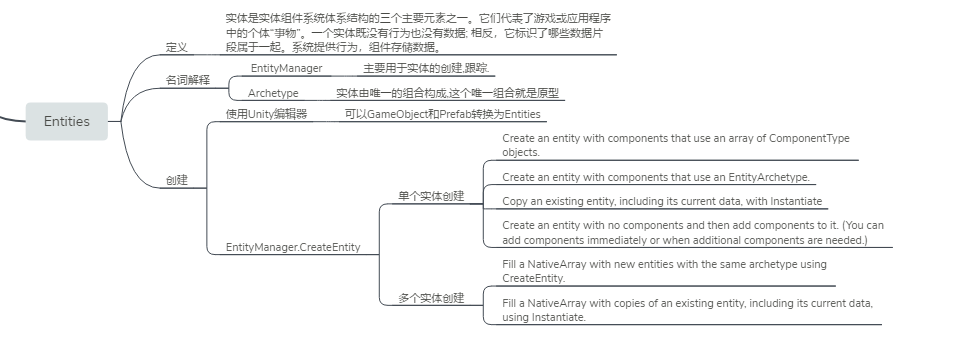

#### 实体的创建

Unity3D提供了4种方式创建实体

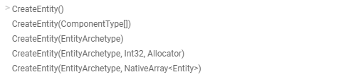

通过实体拷贝创建

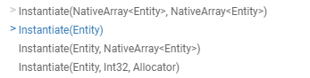

默认情况下实体组件只有一个WorldTime,这个实体由Unity自身创建,使用第一种模式创建实体

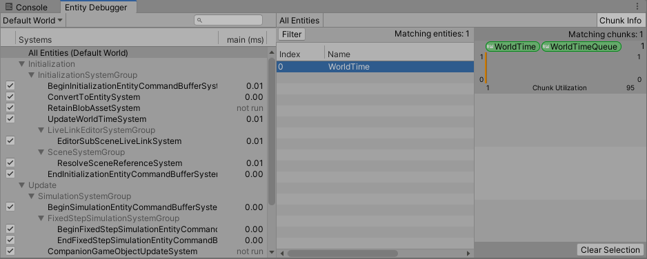

```c#
using UnityEngine;
using Unity.Entities;
public class CreateEntityDemo : MonoBehaviour
{
    // Start is called before the first frame update
    void Start()
    {
        //从World获取EntityManager
        World w = World.DefaultGameObjectInjectionWorld;    

        //CreateEntity()       
        w.EntityManager.CreateEntity();
    }
}
```

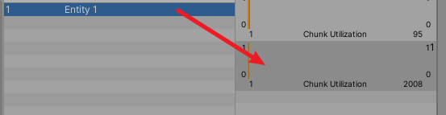

#### 实体对应组件的添加

实体对应组件的添加和删除会引起,实体的变化会引起原型的变化,以及EntityManager会跟踪这些操作,并把它移动到新的原型中去.

注意: 添加和删除组件,修改ShadedComponentData的值,删除对应的实体,不能在job中进行.(对于多线程操作,你应该懂的). 但是Unity3D给你提供了一个
新的接口,使用EntityCommandBuffer,才这个job结束之后进行对应的操作.
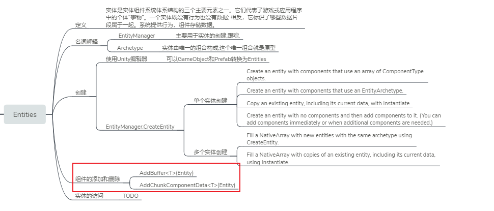
组件的添加和删除操作,也是通过EntityManager来进行的,他可以针对单个实体进行添加和删除,也可以针对多个实体进行添加和删除.

> 添加组件

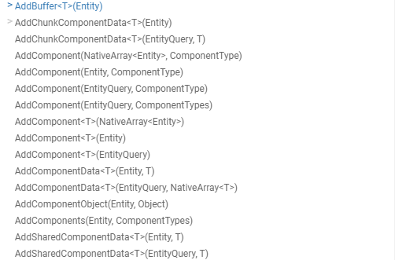

> 删除组件

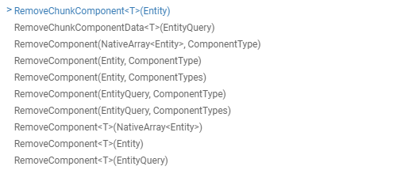

> 实例代码

```
public class AddRemoveComponent : MonoBehaviour
{
    private World w;
    private Entity e;
    // Start is called before the first frame update
    void Start()
    {
        w = World.DefaultGameObjectInjectionWorld;

        e = w.EntityManager.CreateEntity(typeof(EmptyData), typeof(Transform));

        AddComponent1();
    }

    // AddComponent(Entity, ComponentType)
    void AddComponent1()
    {
        w.EntityManager.AddComponent(e, typeof(IntData));
    }
}
```

未AddComponent对应的原型如下:

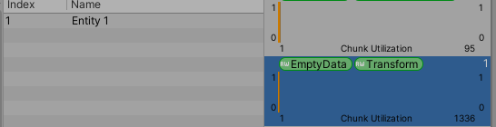

添加AddComponent后会触发原型的变更,对应结果如下:

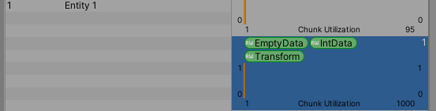


### 什么是组件(Components)


### 什么是SubScene
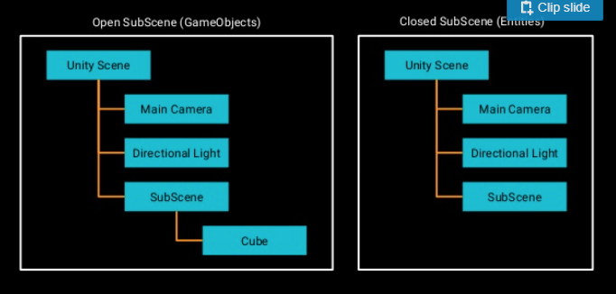


## GameObject


## ComponentSystemBase


[https://github.com/reeseschultz/ReeseUnityDemos](https://github.com/reeseschultz/ReeseUnityDemos)

问题总结:


[https://forum.unity.com/threads/unity-render-pipeline-debug-clashes-with-new-input-system.735179/](https://forum.unity.com/threads/unity-render-pipeline-debug-clashes-with-new-input-system.735179/)


经常会遇到object is not initialized or has already been destroyed
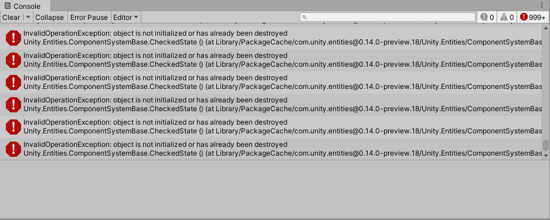


2020年9月29日 17:05:18:
1. 移动物体without jobsystem
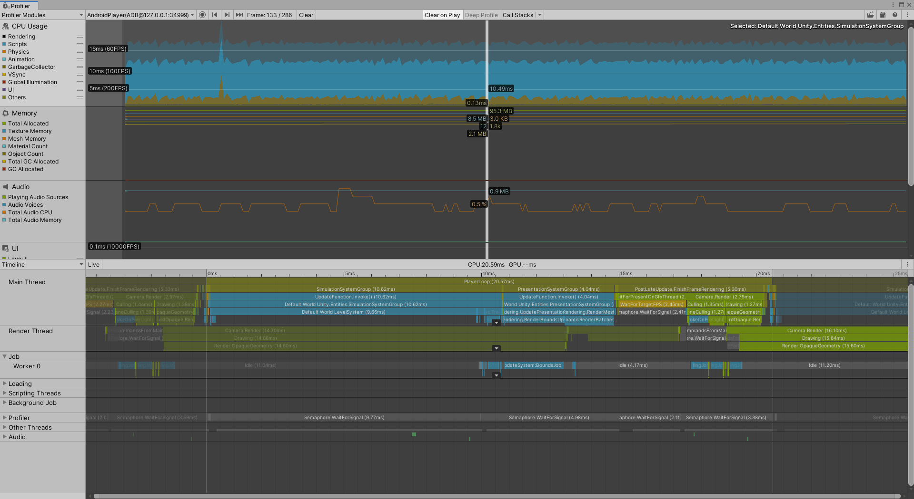

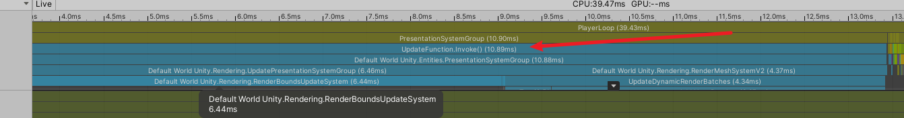

## 带Burst编译
```c#
[BurstCompile]
protected override void OnUpdate()
{
    // Iterate through all entities containing a LevelComponent
    Entities.ForEach((ref Translation t, ref LevelComponent levelComponent) =>
    {
        // Increment level by 1 per second
        levelComponent.level += 1f;
        for(int i =0; i < 1000; i++)
        {
            t.Value.x += 0.0001f;
        }
    }).Schedule();
}
```
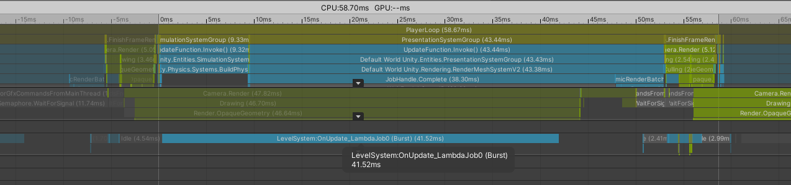

## 不带brust编译
```c#
//[BurstCompile]
protected override void OnUpdate()
{
    // Iterate through all entities containing a LevelComponent
    Entities.ForEach((ref Translation t, ref LevelComponent levelComponent) =>
    {
        // Increment level by 1 per second
        levelComponent.level += 1f;
        for(int i =0; i < 1000; i++)
        {
            t.Value.x += 0.0001f;
        }
    }).Schedule();
}
```
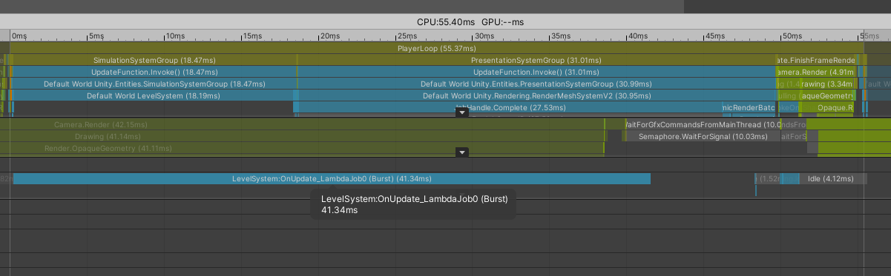

2020年9月30日 10:02:02:
1. 不同的机型Worker数量不一致
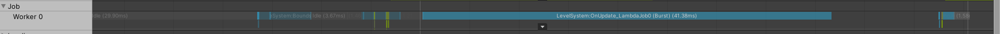

## 工作流程的变更

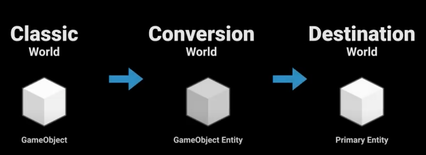

1. 使用组件(CoverToEntity)
2. Prefab到实体组件


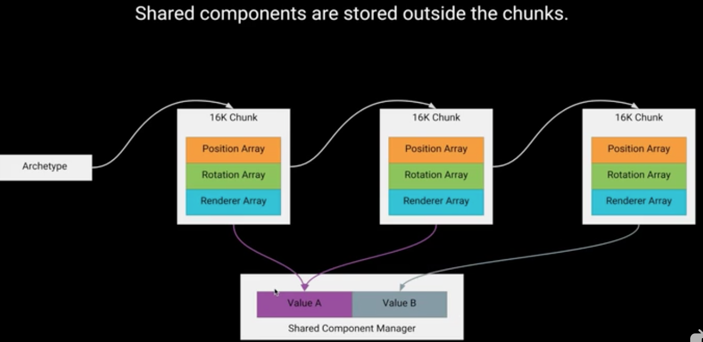


