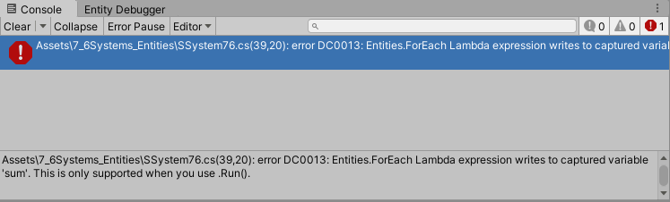
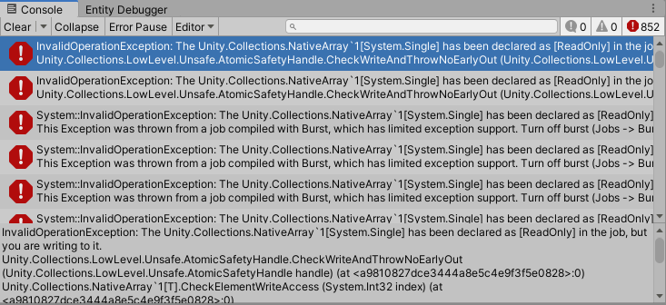
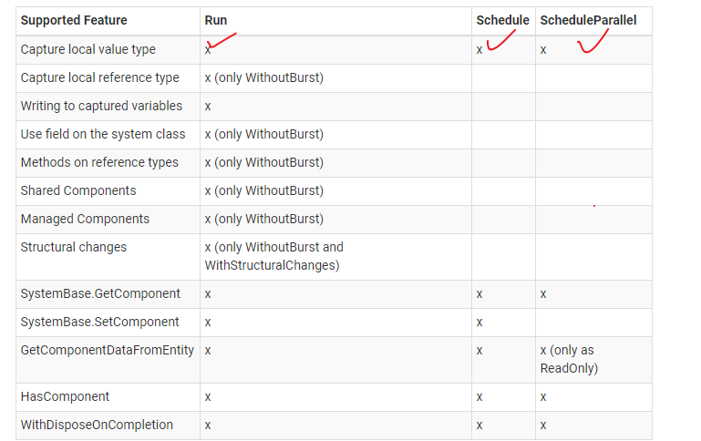
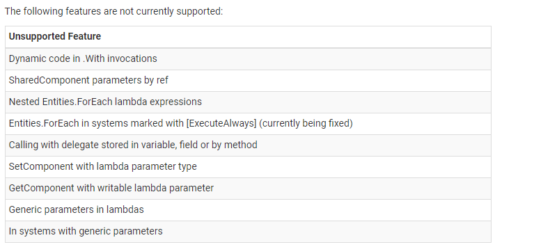
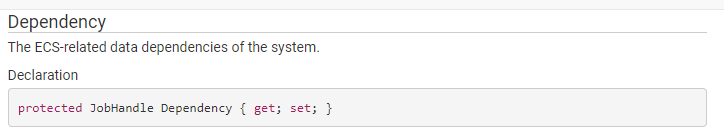
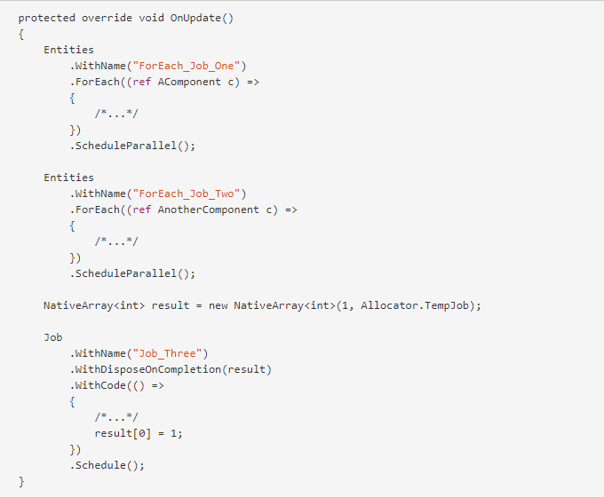
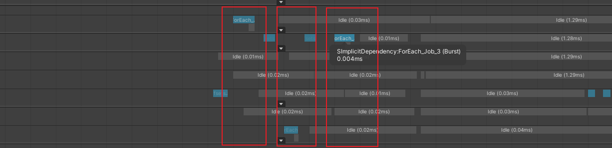
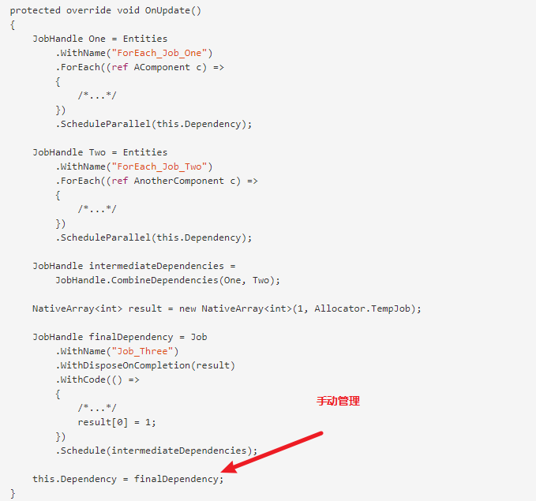
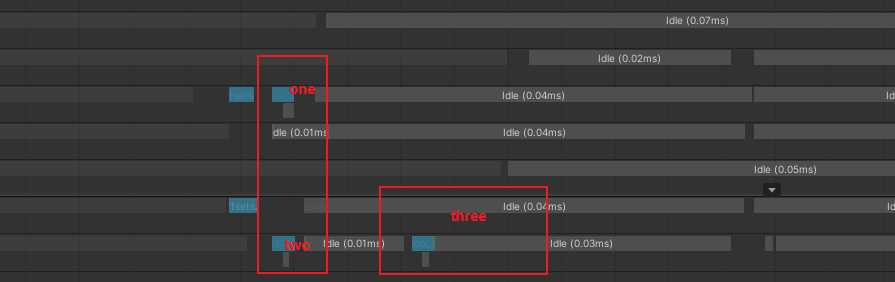

# 2020.10.14Unity3D_DOTS_System

## Capturing variables
```c#
/*
 * Capturing variables
 * 
 * //使用Run方法调度job
 * You can capture local variables for Entities.ForEach lambda functions. 
 
 * 
 * //使用Schedule 方法调用job, 数据访问有一些限制. 
 * When you execute the function using a job (by calling one of the Schedule functions instead of Run) there are some restrictions on the captured variables and how you use them:
   
    1. Only native containers and blittable types can be captured. 只支持值类型
    2. A job can only write to captured variables that are native containers. (To “return” a single value, create a native array with one element.) 如果你向写入数据,需要使用native containers
 * 
 */
```


```c#
float sum = 0;
Entities.WithReadOnly(typeof(CData76))
.ForEach((int entityInQueryIndex, in DynamicBuffer<CData76> data) =>
{

    for (int i = 0; i < data.Length; i++)
    {
       sum += data[i].Value;
    }
    // Implement the work to perform for each entity here.
    // You should only access data that is local or that is a
    // field on this job. Note that the 'rotation' parameter is
    // marked as 'in', which means it cannot be modified,
    // but allows this job to run in parallel with other jobs
    // that want to read Rotation component data.
    // For example,
    //     translation.Value += math.mul(rotation.Value, new float3(0, 0, 1)) * deltaTime;
}).WithName("OnUpdate")
.Schedule(); //不能访问sum,局部变量
//.Run();    //使用Run可以访问局部变量
```



```c#
NativeArray<float> sumArray = new NativeArray<float>(1, Allocator.TempJob);

Entities.WithReadOnly(typeof(CData76))
    .ForEach((int entityInQueryIndex, in DynamicBuffer<CData76> data) => {
    
        for(int i=0;i < data.Length; i++)
        {
            sumArray[0] += data[i].Value;
        }            
}).WithName("OnUpdate")
.Schedule();
```
### WithReadOnly//局部变量访问修饰

If you read a [native container], but don't write to it, always specify read-only access using WithReadOnly(variable)

使用函数的来处理这个问题的原因:

Entities.ForEach provides these as functions because the C# language doesn't allow attibutes on local variables.

```c#
 NativeArray<float> itemArray = new NativeArray<float>(10, Allocator.Persistent);
for(int i=0; i < 10; i++)
{
    itemArray[i] = i;
}

NativeArray<float> sum = new NativeArray<float>(1, Allocator.Persistent);

Entities
    .WithReadOnly(itemArray)                //针对局部变量访问,通过WithReadOnly,来加速job计算
    .WithReadOnly(sum)                       //注意:这地方开启会报错
    .WithStoreEntityQueryInField(ref query)
    .ForEach((int entityInQueryIndex, in DynamicBuffer<CData76> data) =>
    {
        for(int i=0; i< itemArray.Length; i++)
        {
            sum[0] += itemArray[i];
        }
    }).WithName("OnUpdate")
    .WithDisposeOnCompletion(sum)
    .WithDisposeOnCompletion(itemArray)
    .Schedule();
```




### WithDisposeOnCompletion//局部变量的销毁工作

看上面的例子代码即可.在运行完Job后进行动态数组的销毁工作

### Supported Features


Entites.Foreach 会把内存的代码转化为特殊的IL指令. 因此不能使用复杂的引用类型. 反正就是有诸多限制



### Dependencies

System会通过Dependency属性对Job进行依赖管理,  默认是隐式依赖管理. 当然可以手动进行管理.



下面的代码就是隐式依赖管理



对应的数据结果如下,他们分别放在了不同的worker,但是时序是做了对应的保证的.




手动进行依赖管理



