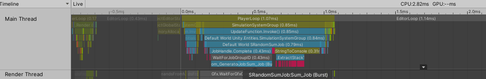
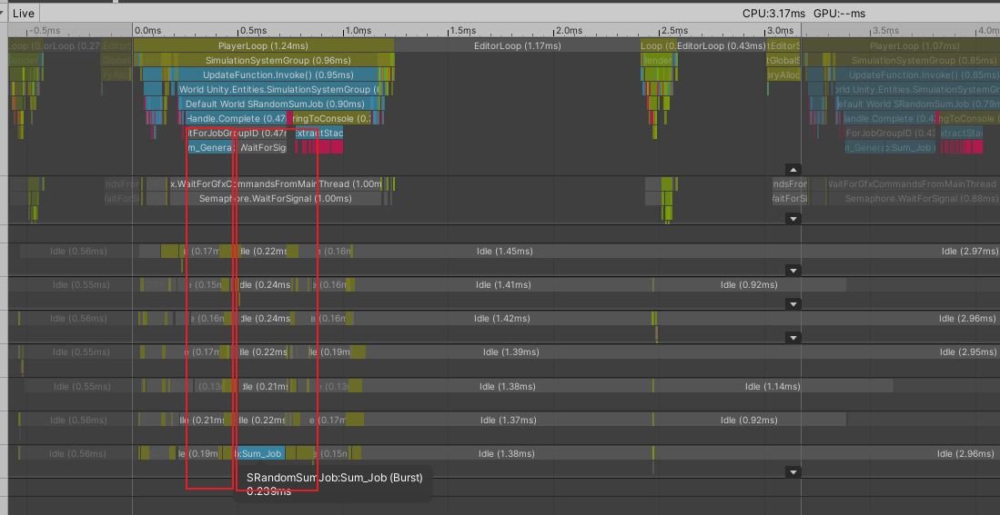
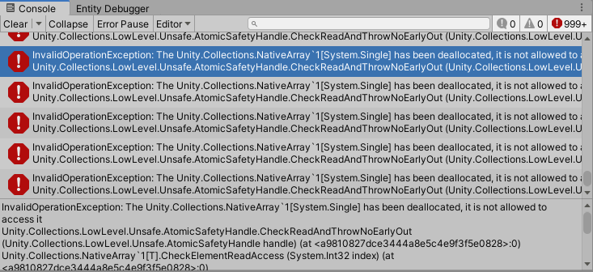

# 2020.10.14Unity3D_DOTS_System_JOBWithCode

```c#
protected override void OnUpdate()
{
    Random r = new Random(seed++);

    NativeArray<float> randomNumbers = new NativeArray<float>(100000, Allocator.TempJob);

    Job.WithCode(() =>
    {
        for (int i = 0; i < randomNumbers.Length; i++)
        {
            randomNumbers[i] = r.NextFloat();
        }
    })
    .WithName("Random_Generator_Job") //不能有空格,使用下划线代替
    .Schedule();

    NativeArray<float> result = new NativeArray<float>(1, Allocator.TempJob);

    Job.WithCode(() =>
    {
        for (int i = 0; i < randomNumbers.Length; i++)
        {
            result[0] += randomNumbers[i];
        }
    })
    .WithName("Sum_Job")
    .Schedule();

    this.CompleteDependency();    // 等待JOB完成

    UnityEngine.Debug.Log("The sum of " + randomNumbers.Length + " numbers is " + result[0]);

    randomNumbers.Dispose();    //必须要有否则4帧后会认为是内存泄漏
    result.Dispose();
}
```

1. 通过如下截图, 对应的JOB也可能会在主线程执行



如果不调用this.CompleteDependency()则是并行完成的




需要明确对应的释放位置

```c#
Job.WithCode(() =>
{
    for (int i = 0; i < randomNumbers.Length; i++)
    {
        result[0] += randomNumbers[i];
    }
})
.WithName("Sum_Job")
.WithDisposeOnCompletion(randomNumbers) //mark dealloc on complete
.WithDisposeOnCompletion(result)        //mark dealloc on complete
.Schedule();

this.CompleteDependency();    // 等待JOB完成, randomNumbers, result会被释放掉

UnityEngine.Debug.Log("The sum of " + randomNumbers.Length + " numbers is " + result[0]); //error
```


## Variables

You cannot pass parameters to the Job.WithCode lambda function or return a value.  Instead, you can capture local variables in your OnUpdate() function.

如果你想获得一个东西,你就得付出对应的代价:

1. Captured variables must be declared as NativeArray -- or other native container -- or a blittable type.
2. To return data, you must write the return value to a captured native array, even if the data is a single value. (Note that you can write to any captured variable when executing with Run().)

跟Entites.ForEach对应的限制类似


## Executing the function

* Schedule() -- executes the function as a single, non-parallel job. Scheduling a job runs the code on a background thread and thus can take better advantage of available CPU resources.

* Run() -- executes the function immediately on the main thread. In most cases the Job.WithCode can be Burst compiled so executing code can be faster inside Job.WithCode even though it is still run on the main thread.
使用brust即使不子线程运行,也是比较快的

## Dependencies

跟Entites.For类似

