# 2020.10.15Unity3D_DOTS_System_IJobChunk


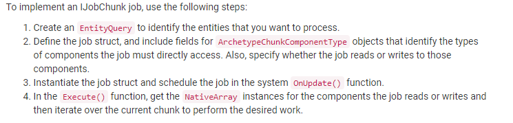

## Query for data with an EntityQuery

1. 使用SystemBase.GetEntityQuery
2. 为了避免GC,在OnCreate进行查询

```c#
// method1
// m_Query = GetEntityQuery(ComponentType.ReadOnly<Rotation>(), ComponentType.ReadOnly<RotationSpeed>());

// method2
//var queryDescription = new EntityQueryDesc()
//{
//	None = new ComponentType[]
//	{
//		typeof(Static)
//	},
//	All = new ComponentType[]
//	{
//		ComponentType.ReadWrite<Rotation>(),	//ComponentType指定类型的同时标记是否对数据读写
//		ComponentType.ReadOnly<RotationSpeed>()
//	},
//  Any = new ComponentType[]
//  {
//  }
//};
//m_Query = GetEntityQuery(queryDescription)

// method3
//var queryDescription0 = new EntityQueryDesc
//{
//	All = new ComponentType[] {typeof(Rotation)}
//};
//var queryDescription1 = new EntityQueryDesc
//{
//	All = new ComponentType[] {typeof(RotationSpeed)}
//};
//m_Query = GetEntityQuery(new EntityQueryDesc[] {queryDescription0, queryDescription1});
```

3. 使用注意事项

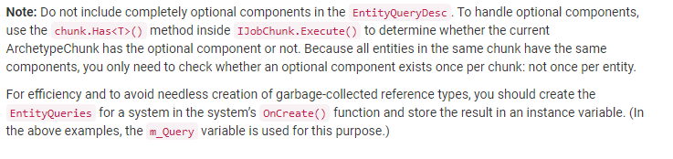

## Define the IJobChunk struct

1. 使用ComponentTypeHandle<T> 声明需要访问的组件类型
2. 编写Execute方法
```c#
[BurstCompile]
struct SRotationSpeedSystemJob : IJobChunk
{
    public float DeltaTime;
    public ComponentTypeHandle<Rotation> RotationTypeHandle;                       //使用ComponentTypeHandle<T> 声明需要访问的组件类型
    [ReadOnly] public ComponentTypeHandle<CRotationSpeed> RotationSpeedTypeHandle;

    public void Execute(ArchetypeChunk chunk, int chunkIndex, int firstEntityIndex)
    {
        throw new System.NotImplementedException();
    }
}
```

## Writing the Execute method
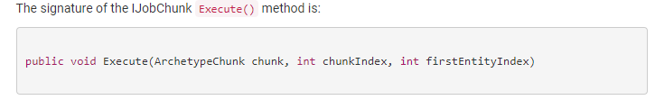

chunk可以拿来做什么事情?

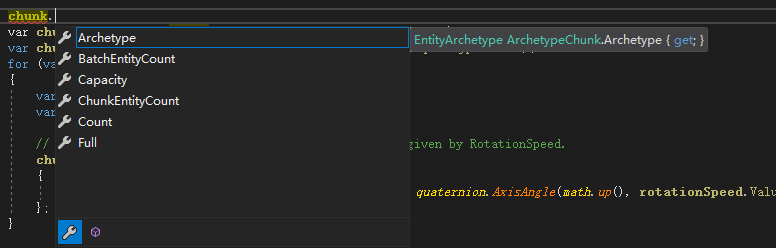

1. 判断是否被修改,用于手动修改过滤

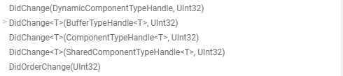

2. 获取对应的ChangeVersion

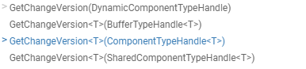

3. 获取对应的ComponentData

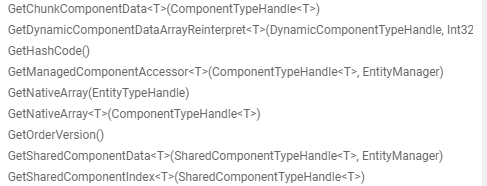

4. Option 组件的判断
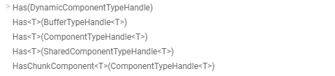


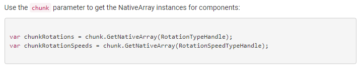


## Instantiate and schedule the job

1. 在OnUpdate中实例化并执行
2. 不要试图缓存GetComponentTypeHandle

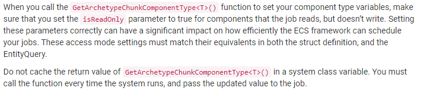


## Skipping chunks with unchanged entities

1. SetChangedVersionFilter in EntityQuery
```c#
protected override void OnCreate()
{
	// method1
    m_Query = GetEntityQuery(ComponentType.ReadWrite<COutput>(), ComponentType.ReadOnly<CInputA>(), ComponentType.ReadOnly<CInputB>());

    m_Query.SetChangedVersionFilter(new ComponentType[]   //修改过滤,提高计算效率
    {
        ComponentType.ReadWrite<CInputA>(),
        ComponentType.ReadWrite<CInputB>()
    });
}
```

2. ArchetypeChunk.DidChange() in IJobChunk.Execute //需要定义 public uint LastSystemVersion;
```c#
[BurstCompile]
struct SSkipChunksSystem2_Job : IJobChunk
{
    [ReadOnly] public ComponentTypeHandle<CInputA> CInputA_TypeHandle;
    [ReadOnly] public ComponentTypeHandle<CInputB> CInputB_TypeHandle;
    public ComponentTypeHandle<COutput> COutput_TypeHandle;
    public uint LastSystemVersion;

    [BurstDiscard]
    public void Execute(ArchetypeChunk chunk, int chunkIndex, int firstEntityIndex)
    {
        var inputAChanged = chunk.DidChange(CInputA_TypeHandle, LastSystemVersion);
        var inputBChanged = chunk.DidChange(CInputB_TypeHandle, LastSystemVersion);
        
        // If neither component changed, skip the current chunk
        if (!(inputAChanged || inputBChanged))
            return;

        // 为了方便,去掉brust编译
        UnityEngine.Debug.Log("------------Change-------------");

        var InputA_Array = chunk.GetNativeArray(CInputA_TypeHandle);
        var InputB_Array = chunk.GetNativeArray(CInputB_TypeHandle);
        var OutPut_Array = chunk.GetNativeArray(COutput_TypeHandle);


        for (int i = 0; i < chunk.Count; i++)
        {
            OutPut_Array[i] = new COutput
            {
                Value = InputA_Array[i].Value + InputB_Array[i].Value
            };
        }
    }
}
```

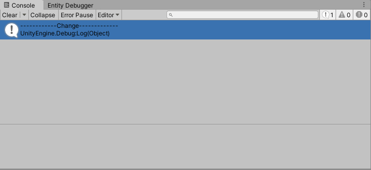

大概的实现原理, 组件的the change version 和 system 的the change version是一个一对多的关系,怎么就能判断出来是否更改呢?这个我并没有搞懂

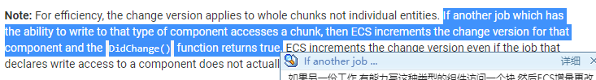

## 遗留的问题,为什么设计这样一套机制? 有什么优势?
