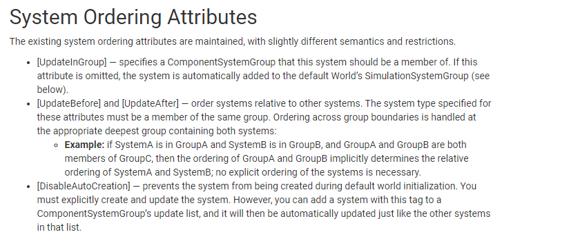
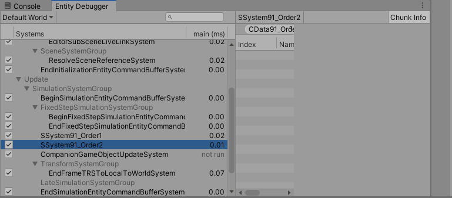
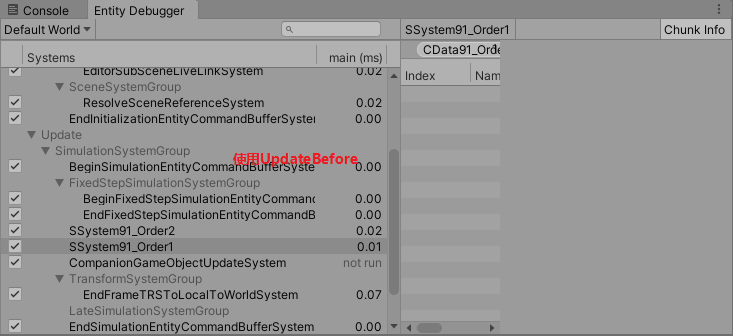
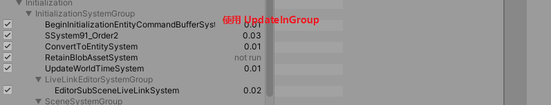
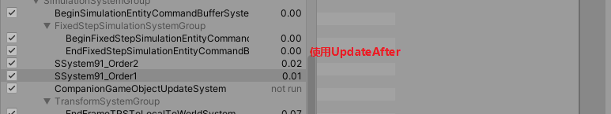
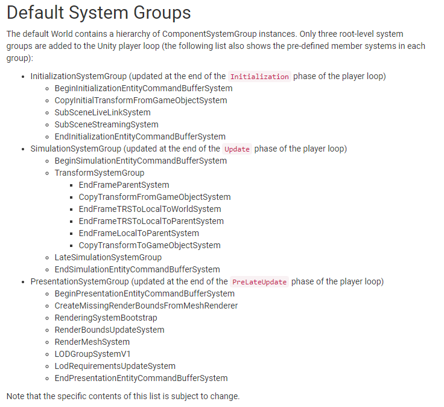

# 2020.10.16Unity3D_DOTS_System_UpdateOrder

## System Ordering Attributes





```c#
[UpdateBefore(typeof(SSystem91_Order1))]
```



1. using the [UpdateInGroup] attribute on the system’s class declaration

```c#
[UpdateInGroup(typeof(InitializationSystemGroup))]
```


```c#
[UpdateAfter(typeof(SSystem91_Order2))]
```


## Default System Groups



## Multiple Worlds

多个世界的目的: 不同帧率更新, 暂时先不研究
