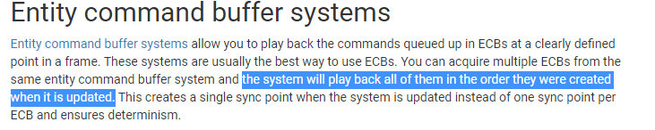
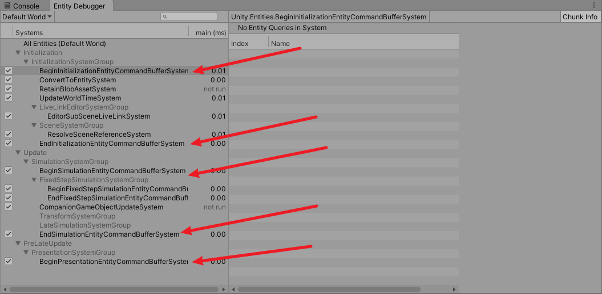

# 2020.10.17Unity3D_DOTS_System_EntityCommandBuffers

2020.09.23Unity3D_DOTS.md 有部分讲解

## ECB想要解决的问题

## 一个System内可以创建多个

执行顺序和创建顺序保持一致

## 尽量使用默认的ECBS

## 并行job里面使用ECB

需要调用ToConcurrent, API已经变更.

