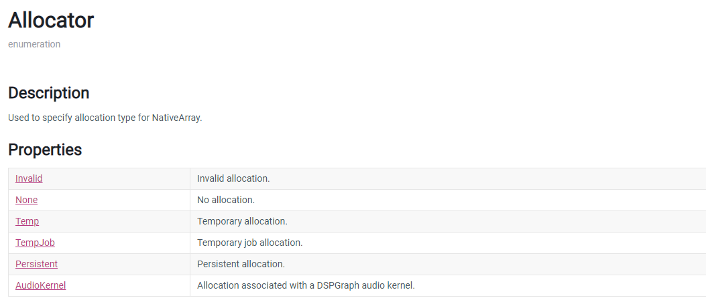
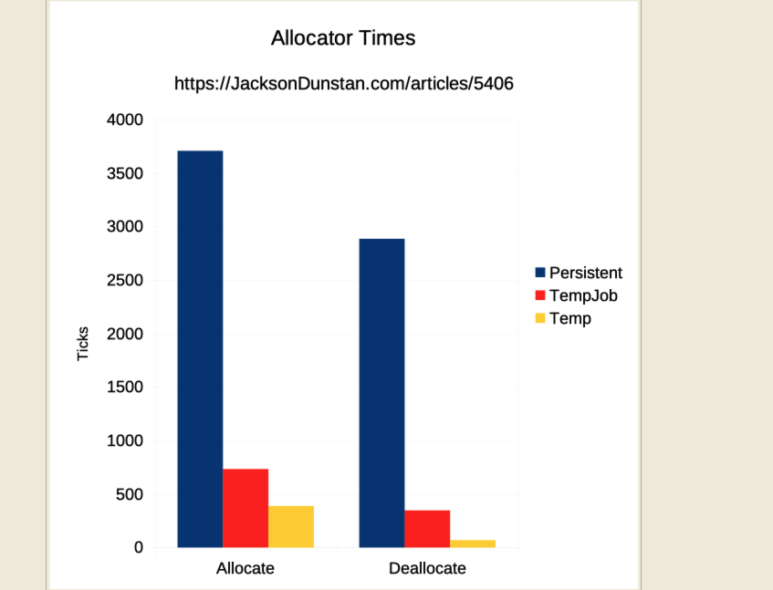
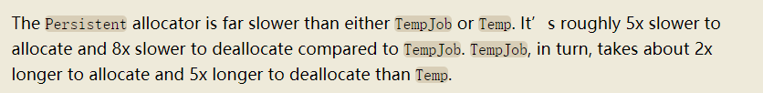
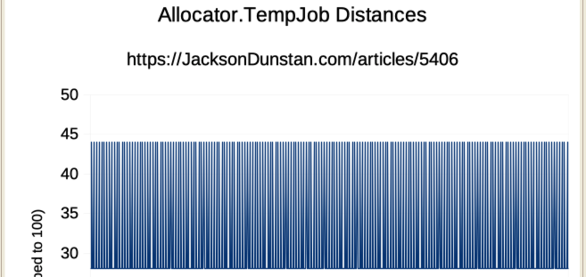
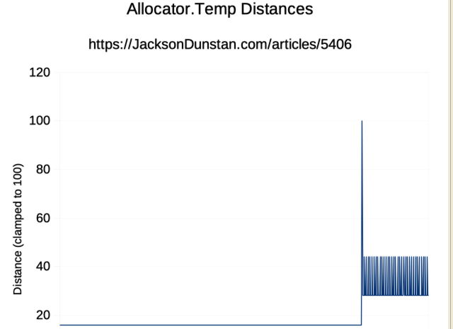
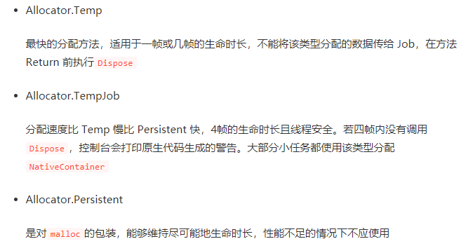

# 2020.10.26Unity3D_NativeMemoryAllocators

## NativeContainer Allocator

these names indicate the lifetime of the memory allocation: forever, a few frames, and one frame.

不同的内存开辟,耗时不一样Persistent方式耗时比较高,所有jobsystem里面绝大多数都是用Temp模式开始内存.

大部分在2mb开销以内,但是并没有什么连续性.

大部分都在45以内,缓存友好. 为什么这么设计呢?这个玩意儿是个jobsystem使用的

### Temp 和 TempJob的区别是什么?

有用的链接:

[https://juejin.im/post/6844904190603427847](https://juejin.im/post/6844904190603427847)

[https://www.jacksondunstan.com/articles/5406](https://www.jacksondunstan.com/articles/5406)
