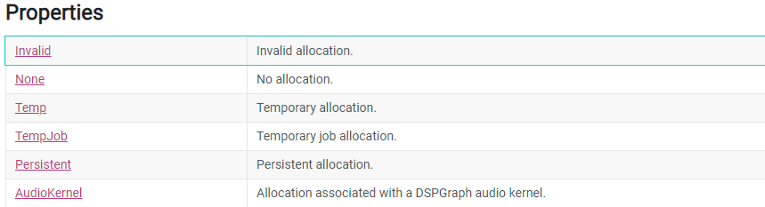

# Unity3D_ECS_Learning

## 第一章: 整体概览(ECS Introduction)

[初学时初略整理的笔记,对应的目标是能够大概理解里面一些新的概念](https://github.com/yhnu/Unity3D_DOTS_Learning/blob/master/2020.09.23Unity3D_DOTS.md/2020.09.23Unity3D_DOTS.md)

例如:

1. DOTS是如何运作的?
2. Archetypes 是什么概念?
3. Memory Chunks 是什么概念?
4. Authoring 是什么意思?
5. World 又是个什么概念?

## 第二章: 详细使用Entities.ForEach进行System编写

[Entity.ForEach 详细使用说明](https://github.com/yhnu/Unity3D_DOTS_Learning/blob/master/2020.10.14Unity3D_DOTS_System_Entites_ForEach.md/2020.10.14Unity3D_DOTS_System_Entites_ForEach.md)

例如:

1. 局部变量获取
2. 访问修饰函数.WithReadOnly
3. 给Job去名称,方便调试
4. 如何返回变量
5. 局部变量销毁工作?
6. JOB的依赖管理

## 第三章: NativeContainer Allocator

[Native Container Allocator](https://github.com/yhnu/Unity3D_DOTS_Learning/blob/master/2020.10.26Unity3D_NativeMemoryAllocators.md/2020.10.26Unity3D_NativeMemoryAllocators.mdhttps://github.com/yhnu/Unity3D_DOTS_Learning/blob/master/2020.10.26Unity3D_NativeMemoryAllocators.md/2020.10.26Unity3D_NativeMemoryAllocators.md) 讲解原始内存分配器的的使用情况,以及优缺点

## 第四章: JOBWithCode

[JobWithCode 详细使用说明已经注意事项](https://github.com/yhnu/Unity3D_DOTS_Learning/blob/master/2020.10.14Unity3D_DOTS_System_JOBWithCode.md/2020.10.14Unity3D_DOTS_System_JOBWithCode.md)

例如:

1. XX.WithName("Random_Generator_Job") //不能有空格,使用下划线代替
2. Allocator不同传参对应不同的含义

3. CompleteDependency 依赖同步问题处理,以及原始内存分配和释放
   
   使用 Dispose
   
   使用 WithDisposeOnCompletion
